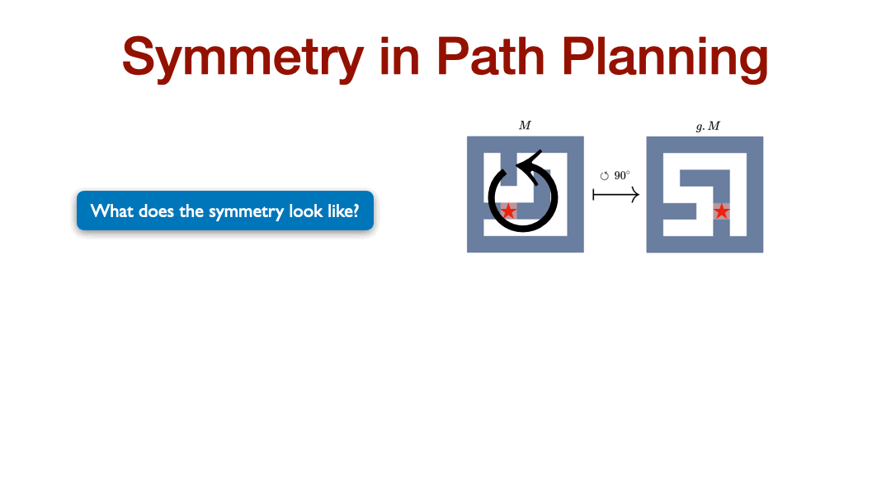
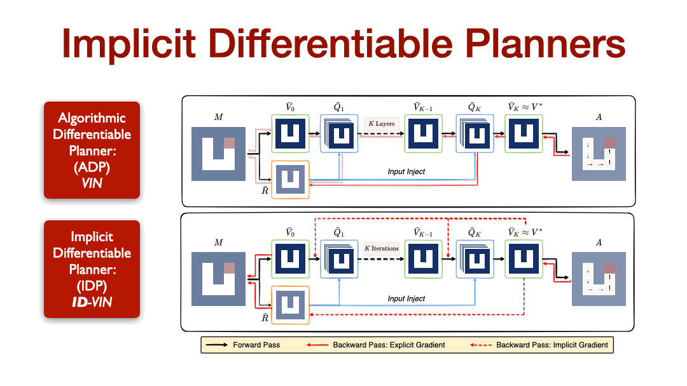

# Differentiable Planning Library


**This is the official codebase for the following two papers:**

### **Integrating Symmetry into Differentiable Planning with Steerable Convolutions**
- **ICLR 2023**
- Linfeng Zhao, Xupeng Zhu, Lingzhi Kong, Robin Walters, Lawson L.S. Wong
- [[Paper]](https://lfzhao.com/paper/paper-symplan-iclr2023.pdf) [[Poster]](https://lfzhao.com/poster/poster-symplan-iclr2023.pdf) [[Slides]](https://lfzhao.com/slides/slides-symplan-iclr2023.pdf) [[ICLR page]](https://iclr.cc/virtual/2023/poster/10993) [[OpenReview]](https://openreview.net/forum?id=n7CPzMPKQl) [[arXiv]](https://arxiv.org/abs/2206.03674)


### **Scaling up and Stabilizing Differentiable Planning with Implicit Differentiation**
- **ICLR 2023**
- Linfeng Zhao, Huazhe Xu, Lawson L.S. Wong
- [[Paper]](https://lfzhao.com/paper/paper-idplan-iclr2023.pdf) [[Poster]](https://lfzhao.com/poster/poster-idplan-iclr2023.pdf) [[Slides]](https://lfzhao.com/slides/slides-idplan-iclr2023.pdf) [[ICLR page]](https://iclr.cc/virtual/2023/poster/10976) [[OpenReview]](https://openreview.net/forum?id=PYbe4MoHf32) [[arXiv]](https://arxiv.org/abs/2210.13542) 


## Papers


### Symmetric Planning




### Implicit Differentiable Planning




## Structure

The codebase is based on a VIN reimplementation `pytorch-value-iteration-networks` and implementation of GPPN `gated-path-planning-networks`.
It is mostly designed for 2D path planning tasks in the papers.

The helper functions contain the utility library from the Deep Equilibrium Models (DEQ) [codebase](https://github.com/locuslab/deq).


## Training Commands


Note: Run all commands under the `src` directory.

- Step 1: Login to your W&B account
    
    - Use `wandb login <your token>`

- Step 2: Generate data

  - Using given maps: 2D navigation
    - `python -m envs.generate_dataset --output-path ../data/m15_4abs-cc_10k.npz --mechanism 4abs-cc --maze-size 15 --train-size 10000 --valid-size 2000 --test-size 2000`
    
  - Using given maps: 2-DOF manipulation
    - `python -m envs.generate_dataset --env=Arm2DoFsEnv --mechanism=4abs-cc-wrap --maze-size=18 --train-size=10000 --valid-size 2000 --test-size 2000 --max-decimation=0.`

  - Using learned maps: 3D visual navigation
    - `xvfb-run -a -s "-screen 0 1024x768x24 -ac +extension GLX +render -noreset" python -m envs.generate_dataset --env Visual3DNav --mechanism 4abs-cc --maze-size 15 --train-size 10000 --valid-size 2000 --test-size 2000 --output-path '../data/Visual3DNav_10k_15_4abs-cc'`
    - Note: This takes several hours to generate and needs around 10GB storage, and the generation would consume around 20GB memory

  - Using learned maps: 2-DOF manipulation
    - `python -m envs.generate_dataset --env=Arm2DoFsWorkSpaceEnv --mechanism=4abs-cc-wrap --maze-size=18 --train-size=10000 --valid-size=1000 --test-size=10000 --max-decimation=0.`

- Step 3: Run training

2D navigation. Planning on given maps, without mapper:

```bash
python main.py run_train with datafile=../data/m15_4abs-cc_10k.npz mechanism=4abs-cc model=models.SymVIN k=20 f=3 group=d4
```

Visual navigation. Planning on learned maps, using mapper:

```bash
python main.py run_train with datafile=../data/Visual3DNav_10k_15_4abs-cc.npz mechanism=4abs-cc model=models.E2-VIN-v4 k=20 f=3 group=d4 mapper=NavMapper planner_loss=True mapper_loss=True
```


## Contact

[Linfeng Zhao](http://lfzhao.com) ([zhao.linf@northeastern.edu](mailto:zhao.linf@northeastern.edu))


## Citation


```
@inproceedings{zhao2023integrating,
  title={Integrating Symmetry into Differentiable Planning with Steerable Convolutions},
  author={Zhao, Linfeng and Zhu, Xupeng and Kong, Lingzhi and Walters, Robin and Wong, Lawson LS},
  booktitle={ICLR},
  year={2023}
}

@inproceedings{zhao2023scaling,
  title={Scaling up and Stabilizing Differentiable Planning with Implicit Differentiation},
  author={Zhao, Linfeng and Xu, Huazhe and Wong, Lawson LS},
  booktitle={ICLR},
  year={2023}
}
```
